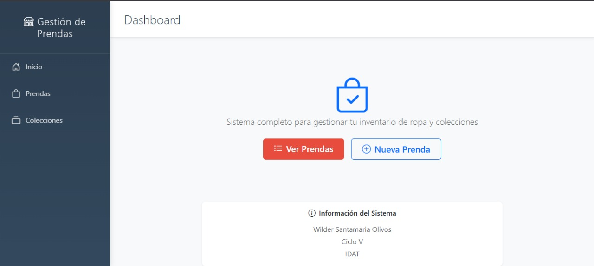

# TiendaColecciones



## 🚀 Aplicación en Vivo
**URL de Producción**: [https://tienda-colecciones-docker.onrender.com](https://tienda-colecciones-docker.onrender.com)

*Nota: Al usar el plan gratuito de Render, la aplicación puede tardar 30-60 segundos en cargar la primera vez si ha estado inactiva.*

## Nombre del proyecto

TiendaColecciones - Sistema de gestión de prendas y colecciones

## Requisitos para desarrollo local

- Java 17
- Maven 3.8+
- MySQL 8.0 (base de datos `tienda_ropa`) o PostgreSQL
- (Opcional) Docker para levantar base de datos rápidamente
- IDE recomendado: VS Code o IntelliJ IDEA

## Pasos de instalación

1. Clonar el repositorio:

```bash
git clone https://github.com/WilderSantamaria18/TiendaColecciones.git
cd TiendaColecciones
```

2. Configurar la base de datos MySQL:

- Crear una base de datos llamada `tienda_ropa` o cambiar la URL en `src/main/resources/application.properties`.
- Credenciales por defecto usadas en el proyecto (modifica si necesario):
  - Usuario: `root`
  - Contraseña: `123456`

3. (Opcional) Levantar MySQL con Docker:

```powershell
docker run --name tienda-mysql -e MYSQL_ROOT_PASSWORD=123456 -e MYSQL_DATABASE=tienda_ropa -p 3306:3306 -d mysql:8.0
```

4. Compilar el proyecto:

```powershell
mvn clean package
```

## Ejecución

- Modo desarrollo (logs en consola):

```powershell
mvn spring-boot:run
```

- Ejecutar JAR empaquetado:

```powershell
java -jar target\Continua3-0.0.1-SNAPSHOT.jar
```

- Acceder a la aplicación en: `http://localhost:8090`

## Rutas principales

- Inicio: `/`
- Lista de prendas: `/web/prendas/listar_prendas`
- Registrar prenda: `/web/prendas/registroPrenda`
- Lista de colecciones: `/web/coleccion/listado`
- Registrar colección: `/web/coleccion/registroColeccion`

## Despliegue en Producción
- **Plataforma**: Render.com
- **Base de datos**: PostgreSQL (Render)
- **Docker**: Aplicación containerizada
- **Dominio**: https://tienda-colecciones-docker.onrender.com

## Capturas del sistema
Aquí se muestran algunas capturas de pantalla del sistema en funcionamiento:


## Autores

- Wilder Santamaria Olivos (Autor principal)

---

### Notas para el profesor / evaluador

- ✅ **Aplicación desplegada en producción**: https://tienda-colecciones-docker.onrender.com
- El proyecto está desarrollado con Spring Boot, Thymeleaf y Bootstrap.
- **Base de datos en producción**: PostgreSQL en Render
- **Para desarrollo local**: revisar que MySQL esté disponible y que las credenciales en `application.properties` coincidan.
- **Docker**: La aplicación está containerizada y lista para despliegue en cualquier plataforma.
